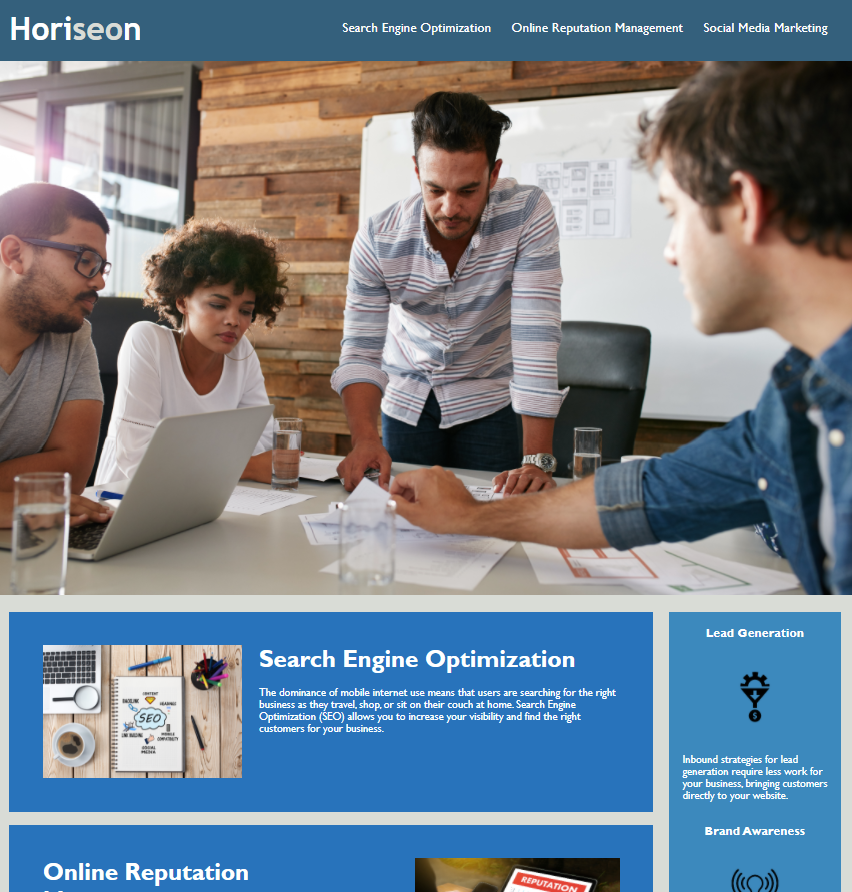

# <Horiseon-Marketing-Agency>

## Description

The purpose of this project was to practice HTML 5 and CSS 3. I wanted to better understand how to consicely and efficiently create a template web page for a marketing company that includes working links, accessible alt texts for images, and appropriately labeled HTML elements and attributes. I learned the importance of anchor elements for creating working links that jump to a specific area on the page and successfully formatted a sidebar using the "aside" syntax.

## Usage

Within the header, you will find three working links that redirect you to the appropriate section of the web page. Within the aside, you will find blurbs and graphics articulating the importance of Lead Generation, Brand Awareness, and Cost Management within the scope of marketing. 

